# GitRoast

**Because sometimes your commit history needs a reality check.**

[](https://gitroast.chahatkesh.me/)

[](https://nextjs.org/)
[](https://www.typescriptlang.org/)
[](https://openai.com/)
[](https://tailwindcss.com/)
[](https://docs.github.com/en/rest)
[](https://www.mongodb.com/)

## ✨ About

GitRoast is a developer-focused web application that provides humorous, AI-generated "roasts" based on a user's GitHub profile statistics. The application analyzes repositories, commit patterns, language choices, and more to generate witty, tech-focused banter that developers can share with their community.

## 🏗️ System Architecture

```mermaid
graph TB
    subgraph "Client Layer"
        A[Next.js Frontend<br/>React 19 + TypeScript]
        B[Tailwind CSS<br/>Responsive UI]
        C[Framer Motion<br/>Animations]
    end
    
    subgraph "API Layer"
        D[Next.js API Routes<br/>Edge Runtime]
        E[GitHub API Handler]
        F[OpenAI API Handler]
        G[Visitor Counter API]
    end
    
    subgraph "External Services"
        H[GitHub REST API<br/>Profile & Repo Data]
        I[OpenAI GPT API<br/>Roast Generation]
        J[MongoDB Atlas<br/>Visitor Analytics]
    end
    
    subgraph "Features"
        K[Profile Analysis]
        L[AI Roast Generation]
        M[Image Export<br/>html-to-image]
        N[Social Sharing<br/>Twitter Integration]
    end
    
    A --> D
    B --> A
    C --> A
    D --> E
    D --> F
    D --> G
    E --> H
    F --> I
    G --> J
    D --> K
    K --> L
    L --> M
    L --> N
    
    style A fill:#000000,stroke:#333,stroke-width:2px
    style D fill:#000000,stroke:#333,stroke-width:2px,color:#fff
    style I fill:#412991,stroke:#333,stroke-width:2px,color:#fff
    style H fill:#181717,stroke:#333,stroke-width:2px,color:#fff
    style J fill:#47A248,stroke:#333,stroke-width:2px,color:#fff
```



### Data Flow

1. **User Input**: User enters GitHub username
2. **Profile Fetching**: GitHub API retrieves user profile and repository data
3. **Data Analysis**: System analyzes commit patterns, languages, and repository statistics
4. **AI Processing**: OpenAI generates personalized roasts based on the analysis
5. **Result Display**: Roasts are presented with visual stats and sharing options
6. **Analytics**: Visitor data is stored in MongoDB for usage insights

## 🚀 Features

- **GitHub Profile Analysis** - Comprehensive analysis of your GitHub footprint
- **AI-Powered Roasts** - Customized roasts generated by OpenAI's GPT models
- **Adjustable Intensity** - Choose between mild, medium, or spicy roast levels
- **Shareable Results** - Export as images or share directly to social media
- **Visual Stats** - Clean visualization of your GitHub metrics
- **Responsive Design** - Optimized for both desktop and mobile experiences

## 🛠️ Tech Stack

- **Frontend:** Next.js 15 (App Router), TypeScript, Tailwind CSS
- **APIs:** OpenAI API, GitHub REST API
- **UI Components:** Lucide React (icons), Framer Motion
- **Utilities:** html-to-image, react-hot-toast

## 🔌 Quick Start

### Prerequisites

- Node.js 18.x or later
- An OpenAI API key
- Optional: GitHub personal access token (for higher rate limits)

### Installation

1. Clone the repository

   ```bash
   git clone https://github.com/chahatkesh/gitroast.git
   cd gitroast
   ```

2. Install dependencies

   ```bash
   npm install
   ```

3. Set up environment variables
   Create a `.env.local` file with:

   ```
   # Required
   OPENAI_API_KEY=your_openai_api_key_here

   # Optional (for higher GitHub API rate limits)
   GITHUB_TOKEN=your_github_token_here

   # App URL (update for production)
   NEXT_PUBLIC_APP_URL=https://gitroast.chahatkesh.me

   # MongoDB connection (required for visitor counting)
   MONGODB_URI=your_mongodb_connection_string
   MONGODB_DB=gitroast
   ```

4. Set up MongoDB

   For the visitor counter functionality, this application uses MongoDB:

   - Create a free MongoDB Atlas account at [https://www.mongodb.com/cloud/atlas/register](https://www.mongodb.com/cloud/atlas/register)
   - Create a new cluster
   - Click "Connect" and choose "Connect your application"
   - Copy the connection string and replace `<username>`, `<password>`, and `<dbname>` with your values
   - Add this connection string to your `.env.local` file as `MONGODB_URI`

5. Start the development server

   ```bash
   npm run dev
   ```

6. Open [http://localhost:3000](http://localhost:3000) in your browser

## 🚀 Deployment

### Live Demo

**Check out the live demo at: [https://gitroast.chahatkesh.me/](https://gitroast.chahatkesh.me/)**

### Build for Production

To build the application for production:

```bash
npm run build
npm start
```

---

<div align="center">
  <p>Built with ❤️ by <a href="https://github.com/chahatkesh">Chahat Kesharwani</a></p>
  <p>© 2025 GitRoast</p>
</div>
